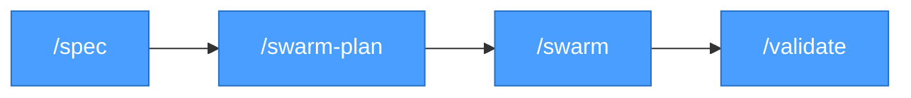
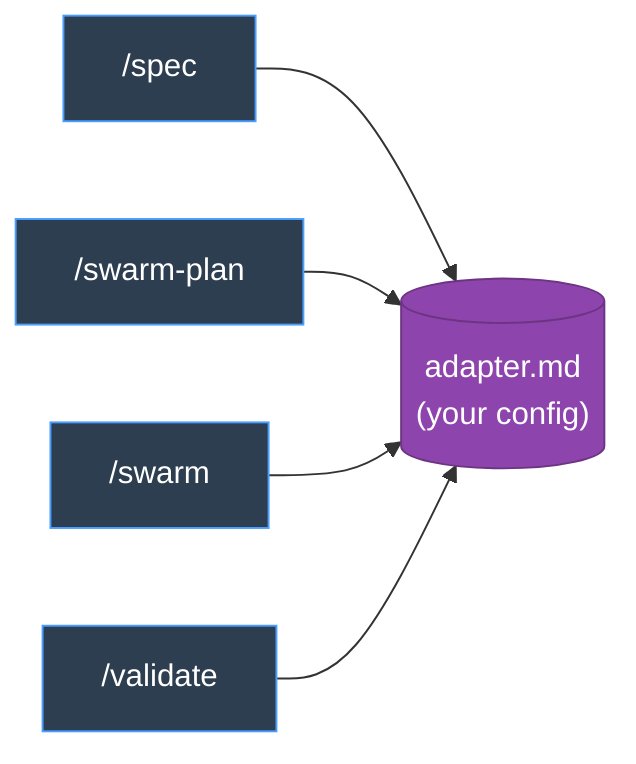
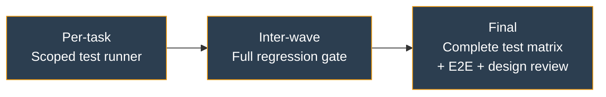
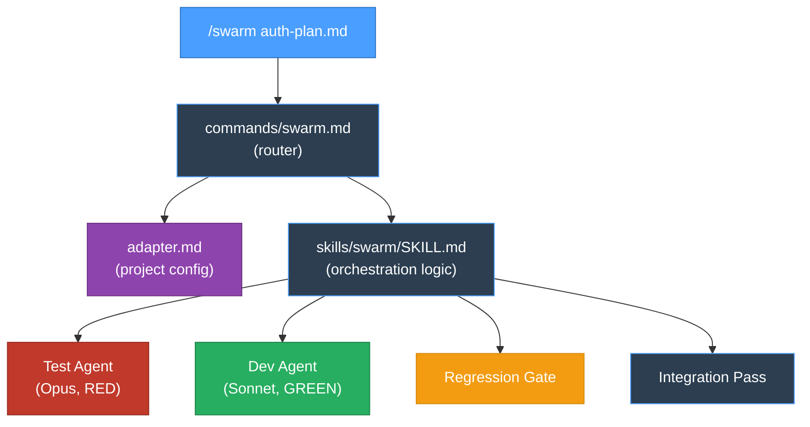

# Claude Swarm Workflow

A 4-phase parallel development workflow for [Claude Code](https://docs.anthropic.com/en/docs/claude-code) that uses TDD with separated test and dev agents, dependency-aware task planning, and automated quality gates.



## What It Does

The swarm workflow turns feature requests into shipped code through four phases:

1. **`/spec`** — Interactive discovery interview that produces a structured specification from a vague idea, ticket, or bug report
2. **`/swarm-plan`** — Decomposes the spec into atomic tasks with an explicit dependency DAG, enabling maximum parallel execution
3. **`/swarm`** — Executes tasks in parallel waves using **separated agents**: a Test Agent (Opus) writes failing tests, then a Dev Agent (Sonnet) implements until green. Regression gates run between waves.
4. **`/validate`** — Full test matrix, regression check, cleanup, code review, documentation updates, and phase closure

### Multi-Agent System: Planning & Parallel Execution

```mermaid
flowchart TB
    TITLE["MULTI-AGENT SYSTEM:\nPLANNING & PARALLEL EXECUTION"]
    TITLE ~~~ SPEC & PLAN & EXEC & VAL

    subgraph SPEC["PHASE 1: SPECIFICATION (/spec)"]
        direction TB
        SP1["1. ORIENT\n(What / Why / Type)\n2-3 questions"]
        SP2["2. CODEBASE EXPLORATION\n(Architecture, patterns,\nexisting tests)"]
        SP3{"3. CLARIFICATION\nNEEDED?"}
        SP3Y["Ask User"]
        SP4["4. FOCUSED DEEP DIVE\n(Acceptance criteria, UX,\nrisks, scope boundaries)"]
        SP5["5. GENERATE SPEC\n(Structured specification\nwith test plan)"]
        SP6[("spec.md")]

        SP1 --> SP2 --> SP3
        SP3 -->|"Yes"| SP3Y --> SP3
        SP3 -->|"No"| SP4 --> SP5 --> SP6
    end

    subgraph PLAN["PHASE 2: SWARM-READY PLANNER (/swarm-plan)"]
        direction TB
        PL1["1. RESEARCH\n(Codebase Investigation)"]
        PL1a{"1a. CLARIFICATION?\n(Stop & Ask if unclear)"}
        PL1aY["Ask User"]
        PL2["2. DECOMPOSE INTO TASKS\n(Define Tasks & depends_on)"]
        PL3["3. BUILD WAVE TABLE\n(Dependency DAG → parallel waves)"]
        PL4["4. SUBAGENT REVIEW\n(Gap Analysis & Revision)"]
        PL5[("plan.md\n(Finalized)")]

        PL1 --> PL1a
        PL1a -->|"Yes"| PL1aY --> PL1a
        PL1a -->|"No"| PL2 --> PL3 --> PL4 --> PL5
    end

    subgraph EXEC["PHASE 3: PARALLEL TASK EXECUTOR (/swarm)"]
        direction TB
        EX1["1. PARSE REQUEST & PLAN\n(Extract Tasks, Dependencies)"]
        EX2["2. IDENTIFY UNBLOCKED TASKS\n(Wave N: No active depends_on)"]
        EX3["3. LAUNCH PARALLEL AGENTS"]

        subgraph AGENTS["Parallel Task Execution"]
            direction LR
            subgraph AGT1["Task Agent (T1)"]
                direction TB
                A1R["Test Agent\n(Opus, RED)"] --> A1G["Dev Agent\n(Sonnet, GREEN)"] --> A1U["Update Plan\n(Log, Commit)"]
            end
            subgraph AGT2["Task Agent (T2)"]
                direction TB
                A2R["Test Agent\n(Opus, RED)"] --> A2G["Dev Agent\n(Sonnet, GREEN)"] --> A2U["Update Plan\n(Log, Commit)"]
            end
            subgraph AGT3["Task Agent (T3)"]
                direction TB
                A3R["Test Agent\n(Opus, RED)"] --> A3G["Dev Agent\n(Sonnet, GREEN)"] --> A3U["Update Plan\n(Log, Commit)"]
            end
        end

        EX4["4. CHECK & VALIDATE WAVE\n(Regression Gate +\nDesign Gate if CSS)"]
        EX4F{"Gate\nPassed?"}
        EX4FIX["Fix Agent\n(Sonnet)"]
        EX5["5. EXECUTION SUMMARY\n& COMPLETE\n(All tasks verified)"]
        REPEAT["REPEAT UNTIL\nALL TASKS COMPLETE\n(Next Wave)"]

        EX1 --> EX2 --> EX3 --> AGENTS --> EX4
        EX4 --> EX4F
        EX4F -->|"Fail"| EX4FIX --> EX4
        EX4F -->|"Pass"| REPEAT
        REPEAT -->|"More waves"| EX2
        REPEAT -->|"All done"| EX5
    end

    subgraph VAL["PHASE 4: VALIDATION (/validate)"]
        direction TB
        VL1["1. FULL TEST MATRIX\n(All test types from adapter)"]
        VL2["2. REGRESSION CHECK\n(Downstream consumers,\nAPI contracts, keybinds)"]
        VL3["3. CLEANUP\n(Debug statements,\ncommented code, TODOs)"]
        VL4["4. CODE QUALITY REVIEW\n(Pure functions, assertions,\ndesign tokens, patterns)"]
        VL5["5. DESIGN REVIEW\n(Web-designer skill, optional)"]
        VL6["6. FEATURE COMPLETION\nMATRIX"]
        VL7["7. DOCUMENTATION\nUPDATES"]
        VL8["8. PHASE CLOSURE\nDOCUMENT"]
        VL9(["SIGN-OFF\n(Phase ready for closure)"])

        VL1 --> VL2 --> VL3 --> VL4 --> VL5 --> VL6 --> VL7 --> VL8 --> VL9
    end

    SP6 -.->|"input to"| PL1
    PL5 -.->|"input to"| EX1
    EX5 ==>|"Stop hook\nauto-chains"| VL1

    ADAPTER[("adapter.md\n(Project Config)")] -.->|"read by all phases"| SPEC
    ADAPTER -.-> PLAN
    ADAPTER -.-> EXEC
    ADAPTER -.-> VAL

    style TITLE fill:#0d1b2a,stroke:#4a9eff,color:#4fc3f7,font-weight:bold
    style SPEC fill:#0d1b2a,stroke:#4a9eff,color:#fff
    style PLAN fill:#0d1b2a,stroke:#4a9eff,color:#fff
    style EXEC fill:#0d1b2a,stroke:#00c853,color:#fff
    style VAL fill:#0d1b2a,stroke:#4a9eff,color:#fff
    style AGENTS fill:#1a2744,stroke:#4a9eff,color:#fff
    style AGT1 fill:#0f3460,stroke:#e94560,color:#fff
    style AGT2 fill:#0f3460,stroke:#e94560,color:#fff
    style AGT3 fill:#0f3460,stroke:#e94560,color:#fff
    style SP1 fill:#1a2744,stroke:#4a9eff,color:#e0e0e0
    style SP2 fill:#1a2744,stroke:#4a9eff,color:#e0e0e0
    style SP3 fill:#1a2744,stroke:#f39c12,color:#e0e0e0
    style SP3Y fill:#263859,stroke:#f39c12,color:#f39c12
    style SP4 fill:#1a2744,stroke:#4a9eff,color:#e0e0e0
    style SP5 fill:#1a2744,stroke:#4a9eff,color:#e0e0e0
    style SP6 fill:#8e44ad,stroke:#6c3483,color:#fff
    style PL1 fill:#1a2744,stroke:#4a9eff,color:#e0e0e0
    style PL1a fill:#1a2744,stroke:#f39c12,color:#e0e0e0
    style PL1aY fill:#263859,stroke:#f39c12,color:#f39c12
    style PL2 fill:#1a2744,stroke:#4a9eff,color:#e0e0e0
    style PL3 fill:#1a2744,stroke:#4a9eff,color:#e0e0e0
    style PL4 fill:#1a2744,stroke:#4a9eff,color:#e0e0e0
    style PL5 fill:#8e44ad,stroke:#6c3483,color:#fff
    style EX1 fill:#1a3a2a,stroke:#00c853,color:#e0e0e0
    style EX2 fill:#1a3a2a,stroke:#00c853,color:#e0e0e0
    style EX3 fill:#1a3a2a,stroke:#00c853,color:#e0e0e0
    style EX4 fill:#1a3a2a,stroke:#00c853,color:#e0e0e0
    style EX4F fill:#1a3a2a,stroke:#f39c12,color:#e0e0e0
    style EX4FIX fill:#e67e22,stroke:#ca6f1e,color:#fff
    style EX5 fill:#1a3a2a,stroke:#00c853,color:#e0e0e0
    style REPEAT fill:#263859,stroke:#00c853,color:#69f0ae
    style A1R fill:#c0392b,stroke:#922b21,color:#fff
    style A1G fill:#27ae60,stroke:#1e8449,color:#fff
    style A1U fill:#2c3e50,stroke:#4a9eff,color:#e0e0e0
    style A2R fill:#c0392b,stroke:#922b21,color:#fff
    style A2G fill:#27ae60,stroke:#1e8449,color:#fff
    style A2U fill:#2c3e50,stroke:#4a9eff,color:#e0e0e0
    style A3R fill:#c0392b,stroke:#922b21,color:#fff
    style A3G fill:#27ae60,stroke:#1e8449,color:#fff
    style A3U fill:#2c3e50,stroke:#4a9eff,color:#e0e0e0
    style VL1 fill:#1a2744,stroke:#4a9eff,color:#e0e0e0
    style VL2 fill:#1a2744,stroke:#4a9eff,color:#e0e0e0
    style VL3 fill:#1a2744,stroke:#4a9eff,color:#e0e0e0
    style VL4 fill:#1a2744,stroke:#4a9eff,color:#e0e0e0
    style VL5 fill:#1a2744,stroke:#4a9eff,color:#e0e0e0
    style VL6 fill:#1a2744,stroke:#4a9eff,color:#e0e0e0
    style VL7 fill:#1a2744,stroke:#4a9eff,color:#e0e0e0
    style VL8 fill:#1a2744,stroke:#4a9eff,color:#e0e0e0
    style VL9 fill:#27ae60,stroke:#1e8449,color:#fff
    style ADAPTER fill:#8e44ad,stroke:#6c3483,color:#fff
```



### Why Agent Separation?

The test agent and dev agent are **different agents with different permissions**:

| Agent | Model | Can Edit | Cannot Edit |
|-------|-------|----------|-------------|
| Test Agent (RED) | Opus | Test files only | Production code |
| Dev Agent (GREEN) | Sonnet | Production code only | Test files |

This separation ensures:
- Tests are a genuine contract, not an afterthought
- The test agent can't be influenced by implementation shortcuts
- The dev agent can't weaken tests to make its life easier
- Tests encode acceptance criteria *before* any code exists

## Installation

### Quick Install

```bash
git clone https://github.com/your-username/claude_swarm_workflow.git
cd claude_swarm_workflow
./install.sh /path/to/your/project
```

### With Optional Add-ons

```bash
# Include visual design review (requires Playwright MCP)
./install.sh /path/to/your/project --with-design-review

# Include Cursor IDE agent configs
./install.sh /path/to/your/project --with-cursor

# Include everything
./install.sh /path/to/your/project --with-design-review --with-cursor
```

### Manual Install

Copy the contents of `workflow/` into your project root:

```bash
cp -r workflow/.claude /path/to/your/project/.claude
```

### What Gets Installed

```
your-project/
└── .claude/
    ├── adapter.md              ← YOU EDIT THIS (project-specific config)
    ├── settings.json           ← Permissions + auto-lint hook config
    ├── commands/               ← Slash command entry points
    │   ├── spec.md
    │   ├── swarm-plan.md
    │   ├── swarm.md
    │   └── validate.md
    ├── skills/                 ← Detailed workflow logic
    │   ├── spec/SKILL.md
    │   ├── swarm-plan/SKILL.md
    │   ├── swarm/SKILL.md
    │   └── validate/SKILL.md
    └── hooks/
        └── auto-lint.sh        ← YOU EDIT THIS (your linter commands)
```

## Configuration

After installing, you need to configure two files for your project.

### 1. The Adapter (`.claude/adapter.md`)

The adapter is the **single source of truth** for project-specific configuration. Every skill reads it first. Fill in:

| Section | What to Configure | Example |
|---------|-------------------|---------|
| **Stack** | Languages, frameworks, tools | Python FastAPI, React/TypeScript |
| **Test Matrix** | Test types, runners, when to use each | `npm test`, `pytest`, `playwright test` |
| **Regression Gates** | Command that runs between waves | `make lint && npm test && pytest` |
| **Lint** | Your lint command | `make lint` |
| **Environment** | Setup, start, stop commands | `docker compose up`, `npm run dev` |
| **Conventions** | Spec paths, feature tracker, design docs | `docs/specs/`, `FEATURES.md` |
| **File Patterns** | Where components, tests, styles live | `src/components/**/*.tsx` |
| **Test Architecture** | Pure functions → unit → integration → E2E | Concept-to-code mapping |

See `examples/hexmap-cartographer/adapter.md` for a complete real-world example.

### 2. The Auto-Lint Hook (`.claude/hooks/auto-lint.sh`)

This hook runs your linter automatically after every file edit. Uncomment and configure the patterns for your languages:

```bash
case "$FILE_PATH" in
  *.py)
    ruff check --fix "$FILE_PATH" 2>/dev/null
    ruff format "$FILE_PATH" 2>/dev/null
    ;;
  *.ts|*.tsx)
    cd frontend && npx eslint --fix "../$FILE_PATH" 2>/dev/null
    ;;
esac
```

See `examples/hexmap-cartographer/auto-lint.sh` for a complete real-world example.

## Usage

### Phase 1: Specification (`/spec`)

Start here when you have a vague idea, feature request, or bug report.

```
> /spec Add user authentication with OAuth
```

The spec agent will:
1. Ask 2-3 orienting questions (what, why, type)
2. Explore your codebase to understand current patterns
3. Ask focused follow-up questions about acceptance criteria, UX, risks
4. Generate a structured spec at your configured spec path

**Output**: `docs/specs/2026-03-24-user-auth.md`

**When to skip**: If you already have clear requirements and acceptance criteria, jump to `/swarm-plan` or `/swarm`.

### Phase 2: Planning (`/swarm-plan`)

Decompose a spec (or clear description) into parallel-executable tasks.

```
> /swarm-plan docs/specs/2026-03-24-user-auth.md
```

The planner will:
1. Research your codebase architecture and patterns
2. Break work into atomic tasks with explicit dependencies
3. Ensure no two tasks edit the same file (parallel safety)
4. Calculate parallel execution waves from the dependency DAG
5. Have a subagent review the plan for gaps

**Output**: `user-auth-plan.md` with tasks, dependency graph, and wave table

**Key constraint**: File ownership — no two tasks can edit the same file. This is what enables safe parallel execution.

### Phase 3: Execution (`/swarm`)

Execute the plan with parallel test/dev agents.

```
> /swarm user-auth-plan.md
```

For each task, two agents run sequentially:
1. **Test Agent (Opus)** writes failing tests encoding all acceptance criteria → proves RED
2. **Dev Agent (Sonnet)** implements production code until tests pass → proves GREEN

Between waves, a regression gate runs your full test suite. No wave starts until the previous one is green.

```
> /swarm user-auth-plan.md T1 T3    # Run specific tasks only
```

**Auto-chain**: When all tasks complete and regression passes, the Stop hook automatically chains into `/validate`.

### Phase 4: Validation (`/validate`)

Full quality pass before closure.

```
> /validate
```

The validator runs through a 9-step checklist:
1. Full test matrix (all test types)
2. Regression check (downstream consumers, conflicts)
3. Cleanup (debug statements, commented code)
4. Code quality review
5. Design review (if frontend changes, optional)
6. Feature completion matrix
7. Documentation updates
8. Phase closure document (if closing a phase)
9. Sign-off

## Architecture

### The Adapter Pattern



Skills are **generic** — they work for any project. The adapter is **specific** — it tells skills your test commands, file patterns, and conventions. This separation is what makes the workflow portable.

### Model Routing

| Agent Role | Model | Why |
|------------|-------|-----|
| Orchestrator | Opus | Judgment, validation, conflict resolution |
| Swarm Planner | Opus | Deep reasoning, dependency analysis |
| Test Agent (RED) | Opus | Acceptance criteria reasoning, edge cases |
| Dev Agent (GREEN) | Sonnet | Fast implementation, tests define contract |
| Validator | Opus | Broad analysis, regression checking |
| Web Designer | Opus | Visual review (optional) |

### Quality Gates

Three layers catch issues progressively:



### Command → Skill Architecture

Commands are thin routers (2-3 lines). Skills contain the full process logic.



### Hooks

| Hook | Trigger | What It Does |
|------|---------|-------------|
| **Auto-lint** | After every Write/Edit | Runs your linter on the changed file |
| **Swarm→Validate** | When `/swarm` outputs completion signal | Auto-chains into `/validate` |

## Optional Add-ons

### Web Designer Skill (`--with-design-review`)

A design reviewer agent that uses Playwright MCP to screenshot and inspect the running app against your design system.

**Requires**:
- Playwright MCP (`.mcp.json` — installed automatically)
- A design system document (referenced in adapter conventions)
- Optionally, a design identity document (aesthetic philosophy)

**Usage**: `/design-review` for standalone review, or automatically triggered during `/swarm` design gates and `/validate`.

**Customization**: Edit `.claude/skills/web-designer/SKILL.md` to define your design reviewer's aesthetic identity and test criteria.

### Cursor Agents (`--with-cursor`)

Pre-configured Cursor IDE agents that route to the right model:

- **Planner** (Opus): For `/spec`, `/swarm-plan`, `/validate` — deep reasoning
- **Executor** (Sonnet): For `/swarm` dev agents — fast implementation

## Customization

### Adding a New Quality Gate

Edit `.claude/skills/swarm/SKILL.md` Step 3 (Inter-Wave Regression Gate) to add checks:

```markdown
3. If regression passes and the wave touched API endpoints:
   - Run API contract tests: `[command]`
   - Verify OpenAPI spec is up to date
```

### Changing Model Routing

Edit the Model Routing tables in:
- `.claude/adapter.md` (documentation)
- `.claude/skills/swarm/SKILL.md` (agent launch directives)

### Adding a New Skill

1. Create `.claude/skills/your-skill/SKILL.md` with frontmatter
2. Create `.claude/commands/your-command.md` that routes to it
3. Reference it from other skills if needed

### Skipping Phases

The phases are independent — use what you need:

- Small bug fix? Skip to `/swarm` with a plan you write yourself
- Clear requirements? Skip `/spec`, go to `/swarm-plan`
- Single-task change? Skip `/swarm-plan`, use `/swarm` with a simple plan
- Just want validation? Run `/validate` standalone

## Philosophy

### Specs as Memory

Specification documents become institutional knowledge. They capture context, decisions, and rationale so future agents (and humans) don't need to re-discover the same information. Write specs for the reader who arrives 6 months later.

### File Ownership Enables Parallelism

The #1 rule of swarm planning: **no two tasks edit the same file**. This isn't a nice-to-have — it's what makes parallel execution safe. If two agents edit the same file concurrently, one overwrites the other.

### Tests as Contracts

Because the test agent and dev agent are separate, tests become a genuine specification of behavior. The test agent writes what *should* happen based on acceptance criteria. The dev agent implements *how* it happens. Neither can compromise the other.

### Regression Gates Prevent Cascading Failures

Running the full test suite between waves catches problems early. A bug in Wave 1 doesn't silently propagate through Waves 2-5 — it's caught and fixed before the next wave starts.

## Troubleshooting

### "Command not found" when typing `/spec`

Ensure the files are in `.claude/commands/` (not `.claude/skills/`). Claude Code reads commands from the `commands/` directory.

### Adapter not being read

Skills expect the adapter at exactly `.claude/adapter.md`. Check the path is correct and the file isn't empty.

### Auto-lint hook not running

1. Check `.claude/settings.json` has the PostToolUse hook configured
2. Check `.claude/hooks/auto-lint.sh` is executable (`chmod +x`)
3. Check `jq` is installed (the hook parses JSON from stdin)

### Swarm doesn't chain to validate

The Stop hook in `.claude/skills/swarm/SKILL.md` looks for specific completion phrases. Ensure the swarm executor outputs something like "All N tasks complete. Final regression green."

### Test agent writes tests that import nonexistent modules

This is expected — the test agent writes tests *before* implementation exists. The dev agent creates the implementation. RED evidence should show "module not found" or similar, not syntax errors.

## Credits

Inspired by [am-will/swarms](https://github.com/am-will/swarms), adapted with TDD agent separation, regression gates, design gates, and the adapter pattern for project portability.

## License

MIT
